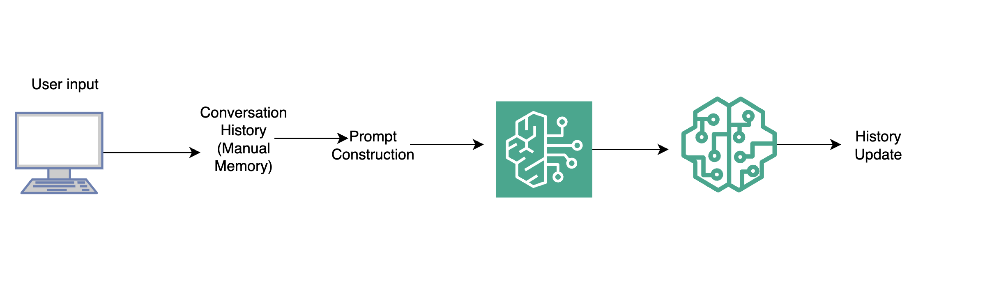
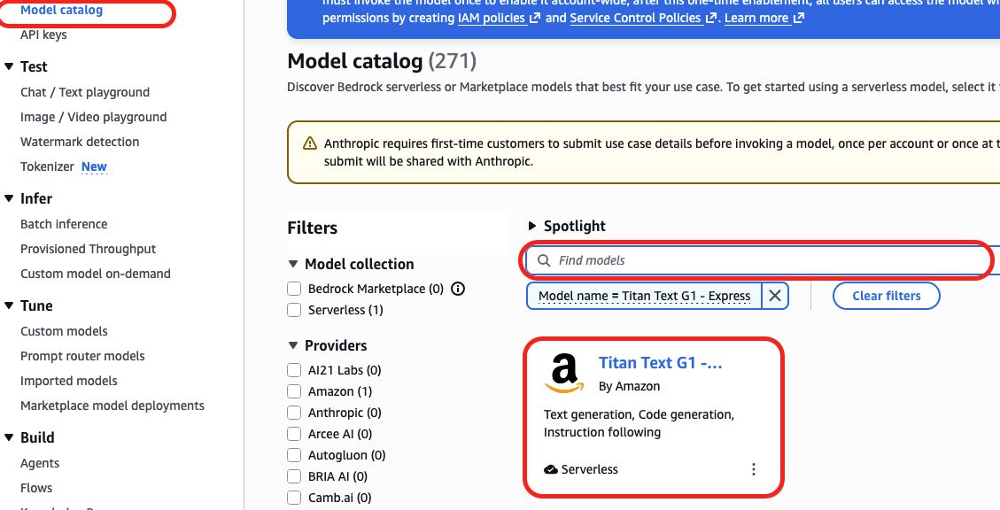
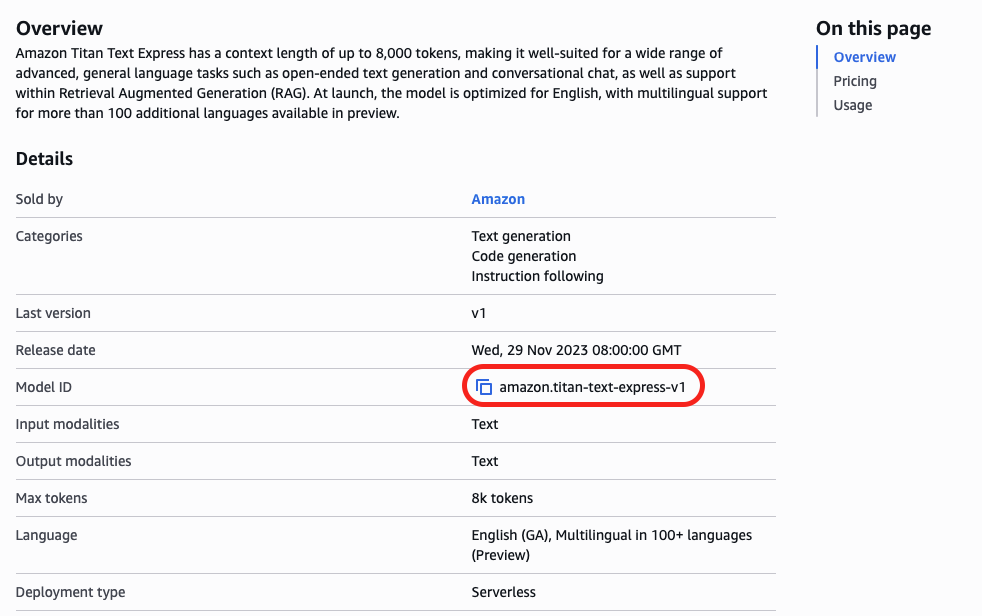

# 🧠 Building a Conversational Chatbot with AWS Bedrock (Amazon Titan)

## Overview
Large Language Models don’t magically “remember” conversations.  
In real-world systems, **conversation state must be explicitly managed**.

In this project, we build a **deterministic, production-style conversational chatbot** using:
- **AWS Bedrock**
- **Amazon Titan Text (`amazon.titan-text-express-v1`)**
- **Python (boto3)**

This project demonstrates how teams can safely integrate **foundation models into enterprise workflows** without giving up control, observability, or reproducibility.


## 🔷 What Is AWS Bedrock?

**Amazon Bedrock** is a **fully managed service** that provides access to multiple  
**foundation models (FMs)** via a single API — without requiring you to manage infrastructure.

With Bedrock, you can:
- Invoke models securely using IAM
- Choose models from different providers
- Keep data within AWS (no model training on your prompts by default)
- Integrate generative AI directly into existing AWS architectures

### 🔑 Key Bedrock Characteristics
- Serverless (no infrastructure management)
- Model-agnostic API
- Enterprise-grade security
- Pay-per-use pricing
- Native AWS integration


## 💼 Business Use Cases of AWS Bedrock

AWS Bedrock is designed for **real business workloads**, not just demos.

### Common Enterprise Use Cases
-  Internal chatbots & AI copilots  
-  Document summarization & analysis  
-  Automated reporting & insight generation  
-  Semantic search over internal data  
-  AI-assisted debugging & data quality analysis  
-  Analytics narrative generation  
-  Customer support automation  

### Why Companies Choose Bedrock
- Data **never leaves AWS**
- IAM-controlled access
- Works seamlessly with **S3, Lambda, Glue, Databricks, Redshift**
- No lock-in to a single model provider


## 🔶 Amazon Titan Text (`amazon.titan-text-express-v1`)

**Amazon Titan Text Express** is a fast, cost-efficient text generation model built by AWS.

### Key Characteristics
- Optimized for **low-latency text generation**
- Ideal for **chatbots, summarization, and explanations**
- Deterministic behavior when temperature is low
- Fully managed and secured by AWS

### When to Use Titan Text Express
- Conversational assistants
- Structured responses
- Enterprise-safe workloads
- Cost-sensitive applications

> ⚠️ Titan does **not** manage conversation state — which is why explicit memory handling (as shown in this project) is essential.

## 🏗 Architecture Overview



**Important:**  
The entire conversation history is sent **on every request**.

## 🧠 Core Design Decisions

### 1️⃣ Explicit Conversation Memory
Amazon Titan does not track sessions.

We:
- Store user and assistant messages
- Append them to a history list
- Inject the full history into each prompt

This makes the system:
- Predictable
- Auditable
- Easy to debug


### 2️⃣ Role-Based Prompt Formatting
Conversation is formatted as:

User: ...
Assistant: ...


This significantly improves response quality and consistency.


### 3️⃣ Stop Sequences
We configure:
```json
"stopSequences": ["User:"]
```

This prevents the model from hallucinating the next user message.

4️⃣ Deterministic Generation

Low temperature

Explicit assistant cue

Token limits

How to Run the Project

Clone the Github repo [AWS Bedrock Chatbot(Titan)](https://github.com/isaacotengdev/Amazon_Bedrock_Chatbot)
Prerequisites
Python 3.9+
AWS credentials configured
AWS Bedrock access enabled

```code
Install Dependencies
pip install boto3

Run the Chatbot
python chatbot.py


Type exit to quit
```
You can also experiment with other models available on the AWS Bedrock service page.

On the AWS Bedrock service page **Click on Model Catalog** . Here you have access to other model providers like Meta, Anthropic, Mistral AI etc. You can search for different models from different or same providers.



**Click on a Model, read it's documentation to understand how to use it in your project and copy the model's ID** 

